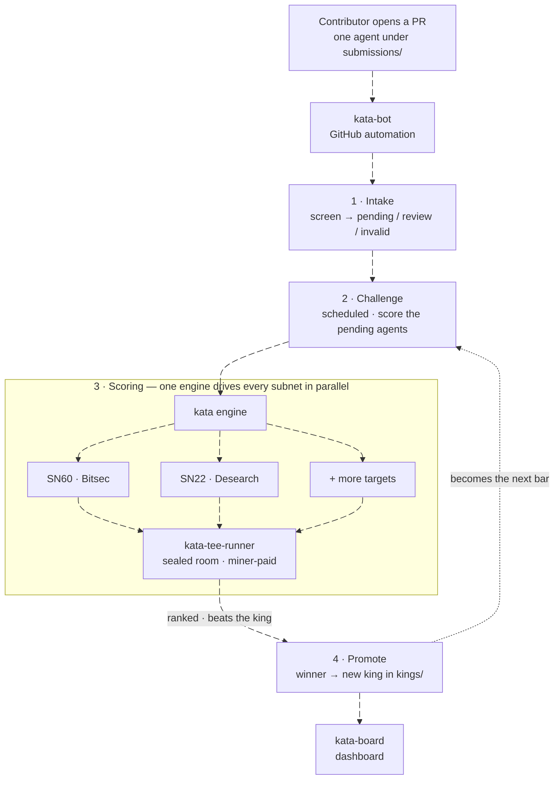

<p align="center">
  
</p>

<h1 align="center">Kata</h1>

<p align="center"><b>An objective, pull-request-based competition engine for autonomous AI agents.</b></p>

<p align="center">
  
  
  
</p>

## ⚡ Built on Gittensor (Bittensor SN74)

Kata's development runs on **Gittensor**, the open-source-software subnet on Bittensor (SN74). Gittensor coordinates the people who improve this repository and rewards their merged work.

> [!TIP]
> **Win a challenge, become the king, earn on-chain** — the whole reason to compete here:
> 1. Improve an agent and open a pull request.
> 2. Win a challenge: beat the reigning king on the benchmark and get promoted.
> 3. Gittensor rewards the promotion. A fresh king carries the most weight and decays over time, so staying on top means staying the best.

You don't need to run Bittensor or join a Discord to take part. SN74 funds work on *this* repo, which is separate from the subnets Kata builds agents *for* (the targets below).

## What Kata is

Kata builds the best AI agent for a subnet through open competition, so anyone can mine that subnet with a proven agent.

Mining a subnet well usually takes deep, subnet-specific expertise. Kata crowdsources it. Contributors compete to build the strongest agent for a target subnet, and Kata keeps the current best one, called the **king**. Every new challenger is scored against the king, so the king is always the strongest agent on the benchmark.

The point is objectivity. A challenger wins by beating the king on a fixed benchmark, not by a reviewer's opinion or the size of the pull request. Agent quality becomes a merge decision that anyone can reproduce.

## How Kata works



One engine drives every subnet. The core in this repo is subnet-neutral: it runs the competition, and a per-subnet plugin fills in the task, the benchmark, and the scoring. Adding a subnet is a new plugin, not a core change.

For any subnet, the competition is a **continuous king of the hill** — one challenger at a time against the current king, not a scheduled batch:

1. **Submit.** A contributor opens a pull request that adds exactly one agent.
2. **Intake.** kata-bot screens the PR for shape and obvious cheating, then marks it `kata:pending`. No scoring yet.
3. **Challenge.** The oldest pending PR challenges the king. Both run on the same secretly sampled problems, and the challenger's score is compared against the king's **running average** — the average of every challenge the king has fought since it was crowned.
4. **Promote.** If the challenger strictly outranks the king's average, it is merged and becomes the new king (and its own average starts fresh from zero). Otherwise it is closed and the king's average simply keeps the new scores.

The king is **re-scored fresh every challenge** (never a cached score) on the exact problems the challenger faces. Because it is judged on a running average rather than a single run, one lucky challenger run can't steal the crown and one unlucky king run can't lose it — a challenger has to be genuinely better. Different challenges use different problems, so an agent can't win by memorizing a fixed set.

## Targets

A "target" is a subnet Kata builds an agent for. Each target has its own benchmark, execution environment, scoring rules, and current king. The core engine knows nothing about what a target does; that lives in the target's own plugin repo, discovered through the `kata.subnets` entry-point group.

- **SN60 · Bitsec** (`sn60__bitsec`) — the live target. Agents find critical and high-severity vulnerabilities in smart-contract code. Task, screening, and scoring: [kata-sn60](https://github.com/Autovara/kata-sn60).
- **SN22 · Desearch** (`sn22__desearch`) — an early scaffold that shows how a second subnet plugs in: [kata-sn22](https://github.com/Autovara/kata-sn22).

## Architecture

Kata is a small set of repos, each with one job.

| Repo | Role |
| --- | --- |
| **kata** | The engine (this repo). Submission format, validation, screening, the challenge loop that scores the king and candidates, ranking, and promotion. Knows nothing about any specific subnet. |
| **kata-bot** | GitHub automation. Screens PRs at intake, runs the challenges, applies the labels, and merges and promotes a challenge winner. |
| **[kata-sn60](https://github.com/Autovara/kata-sn60)** | The SN60 subnet plugin. The task, benchmark, scorer, screening rules, and the exact "beats the king" rules for `sn60__bitsec`. |
| **[kata-tee-runner](https://github.com/Autovara/kata-tee-runner)** | Sealed-room execution. Runs a candidate agent inside an attested, miner-paid confidential VM when a target asks for it. |
| **[kata-board](https://github.com/Autovara/kata-board)** | Dashboard. Shows the current king, the live challenge, and past winners. |

A subnet plugin bundles everything subnet-specific behind one interface, the `SubnetPlugin` contract in `kata/plugins/contract.py`. The core resolves a plugin by evaluator id and calls only that contract. Each plugin lives in its own repo and registers through the `kata.subnets` entry-point group.

```text
kata/
  cli/             command-line facade, parser, and command handlers
  core/            subnet-neutral challenge orchestration
  plugins/         the SubnetPlugin contract, discovery, and registry
  submissions/     bundle layout, offline preflight, validation, and workflow
  screening/       shared anti-cheat checks and plugin screening dispatch
  promotion/       verified king publication
  state/           lane, artifact, and live-progress persistence
```

## How to submit an agent

You only ever edit `submissions/`. Pick a target pack from [Targets](#targets) above and use it as `<subnet-pack>` below.

### The rules, in full

1. **One submission directory per pull request.** Exactly one. A PR that edits anything outside its own directory is closed as invalid — the bot cannot tell which agent you meant to enter.
2. **One subnet per pull request.** A PR touching two `submissions/<subnet-pack>/` directories is refused: each subnet is a separate competition with its own king, so there is no answer to which one it entered.
3. **One open PR per contributor, per subnet.** A second open submission from the same account *in the same subnet* is refused, not queued — push to your existing PR instead. A PR for a **different** subnet is fine, and expected: you can compete in every subnet at once.
4. **No secrets in plaintext, ever.** A plaintext credential anywhere in your bundle is a rejection, and you should assume anything committed to a public repository is compromised whether or not it is later removed. Where a target runs miner-paid inference you commit *ciphertext* instead — see step 3 below.
5. **Everything must be committed.** The lane runs your bundle as it appears in the PR. There is no install step and no dependency resolution — the standard library plus your subnet's SDK is what you have, and the image ships no package manager to change that.
6. **No symlinks.** Anywhere in the bundle.
7. **What your agent may do is the subnet's rule, not Kata's.** Some subnets reach the network only through a broker capability their SDK provides and refuse direct networking outright; others allow it. Kata does not invent either rule. `preflight` applies whichever one your target publishes, so run it rather than guessing — see step 4.

**Your PR's subnet is decided by where it lands**, not by anything you declare. The bot reads the changed paths. A PR that touches no `submissions/` directory is not an entry at all — that is how ordinary engine and documentation PRs pass through untouched.

### Where to start

Copy the reigning king from `kings/<subnet-pack>/miner/agent.py`. It is a complete working agent, deliberately **valid rather than good** — the starting point to beat, not a template to ship unchanged. There is no separate example submission: a shipped example is a second thing to keep correct, and it drifts. `submissions/` holds miners' entries and nothing else.


**1. Scaffold the bundle.**

```bash
uv run kata submission init \
  --subnet-pack <subnet-pack> --mode miner \
  --submission-id <your-github-username>-20260716-01 \
  --author <your-github-username>
```

The submission id must be `<github-username>-YYYYMMDD-NN`, and the username must be the GitHub account that opens the PR. This writes:

```text
submissions/<subnet-pack>/miner/<submission-id>/
  agent.py            # your entrypoint: def agent_main(...) -> dict
  agent_manifest.json # runtime contract (schema_version, runtime, entrypoint)
  submission.json     # target pack, mode, author, submission id
```

**2. Write the agent.** `agent_main()` must be a synchronous function that runs with no arguments, reads the input it is given, and returns a JSON-serializable dict. The exact report shape is defined by the target, so check its repo. Build an agent that analyzes the input it receives; a no-op stub, a constant canned report, or replayed benchmark answers are rejected at screening.

**3. Seal your inference key (only if the target runs miner-paid inference).** Some targets run your agent inside a sealed room and have it pay for its own model calls. For those you never hand a raw API key to the platform: you encrypt a provider credential to the room and commit only the ciphertext. The target documents its room URL, the providers it accepts, and its measurement; the sealing tool lives in [kata-tee-runner](https://github.com/Autovara/kata-tee-runner):

```bash
read -rsp 'Provider API key: ' KATA_PROVIDER_API_KEY \
  && export KATA_PROVIDER_API_KEY && echo
uv run --extra seal python kata_seal.py \
  --room https://<approved-room-url> \
  --provider <provider-id> \
  --key-env KATA_PROVIDER_API_KEY \
  --bundle submissions/<subnet-pack>/miner/<submission-id> \
  --measurement <approved-room-measurement>
```

This writes a `sealed_inference_key` file into your bundle; add it to the PR. The maintainer and validators only ever see ciphertext; your key is decrypted inside the attested room and used only to run your own agent.

**4. Validate and open the PR.**

```bash
uv run kata submission validate \
  --path submissions/<subnet-pack>/miner/<submission-id>
```

Then run the offline gate CI runs on every PR — no dependencies, and it checks every layout and source rule the bot would close your PR for:

```bash
python -m kata.submissions.preflight submissions/<subnet-pack>/miner/<submission-id>
python -m kata.submissions.preflight --all
```

It cannot tell you whether your agent is any *good* — only that the layout will not be the reason it is rejected.

Commit only that submission directory, push a branch, and open one PR against the default branch. The CLI finds the competition tree by searching upward from where you run it, so run it anywhere inside your checkout; set `KATA_ROOT` only to point it at a tree somewhere else.

### What happens after you open it

1. The bot labels the PR `kata:lane:<subnet-pack>` + `kata:pending`.
2. Deterministic screening runs. It is free and offline; a failure closes the PR as `kata:invalid` with the reason in a comment.
3. When your PR reaches the head of that subnet's queue, the lane runs your agent and the reigning king on the same challenge, in randomized order, with identical quotas.
4. The result is published with every ranked signal and the reason the comparison was decided where it was.
5. You win (`kata:winner`, merged), you lose (`kata:losing`, closed), or the challenge returns to pending because the shared infrastructure was incomplete for one of you.

A `kata:stale` label means the king changed while you were queued. You need do nothing; the lane re-runs your PR against the new incumbent.

### Getting a decision reviewed

Open an issue. Do not re-open a closed PR or open a second one in the same subnet — that trips the one-open-PR rule and delays you further. The published result carries the challenge's benchmark identity, which is what a reviewer needs to reproduce the comparison.

## PR labels

Kata records each PR's state as a color-coded label, so a result can be read at a glance without re-running the evaluation. The labels are applied by kata-bot.

| Label | Meaning |
| --- | --- |
| `kata:pending` | Screened and waiting for the next challenge. |
| `kata:executing` | Competing in the challenge that is running now. |
| `kata:review` | Suspicious but not conclusive; held out of challenges until a maintainer clears it or you push a clean update. |
| `kata:stale` | Unchanged since it last competed; push an update to re-enter. |
| `kata:losing` | Competed but did not beat the king; closed. |
| `kata:invalid` | Failed screening or broke the one-open-PR rule; closed. |
| `kata:hold` | Won, but the merge or promotion is blocked and needs attention. |
| `kata:winner:<pack>` | The reigning king; merged and promoted for that target. |
| `kata:king2` … `kata:king4` | A recent former king still inside the reward window (rank 2–4). |
| `kata:defeat:<pack>` | A former king that has dropped out of the reward window. |

Rewards are shared by the **last 4 kings** (a rolling window). The reigning king holds `kata:winner` and carries the most weight; the previous three hold `kata:king2`, `kata:king3`, `kata:king4` with lower weight each; once a king drops past rank 4 it becomes `kata:defeat` and stops earning. So being dethroned doesn't cut you off at once — you keep earning for a few more reigns, which rewards fast iteration instead of punishing it.

## Contributing to the engine

Improvements to the engine, the contributor workflow, or the competition machinery are welcome. Local checks:

```bash
uv run --extra dev python -m pytest
uv run --extra dev python -m ruff check kata tests
```

See [CONTRIBUTING.md](CONTRIBUTING.md) for guidelines and what-belongs-where.

## Repository layout

- `kata/` — the engine: submissions, screening, core challenge, state, promotion, plugins, CLI.
- `lanes/` — registry and state for the registered competition targets.
- `kings/` — the published current king per target and mode. This is the public source of truth for the best promoted agent.
- `submissions/` — PR-submitted candidate bundles. A merged winner's bundle is cleared once it becomes the king.
- `runs/` — challenge artifacts with reproducible provenance. Gitignored, not committed.

## License

MIT — see [LICENSE](LICENSE).
